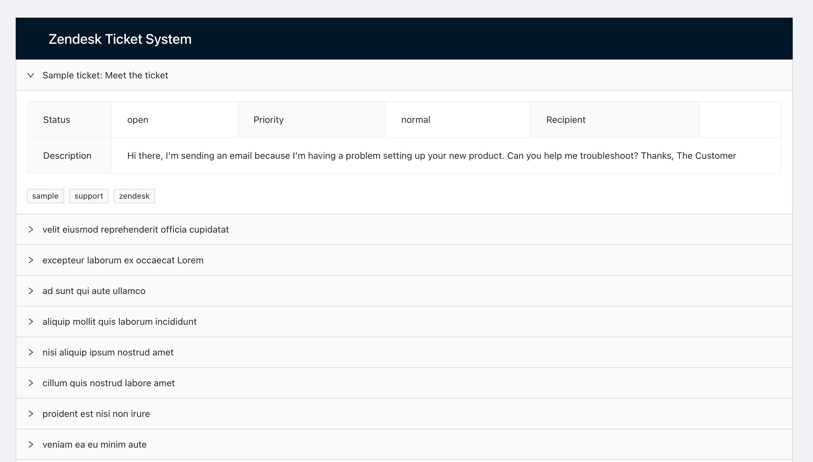
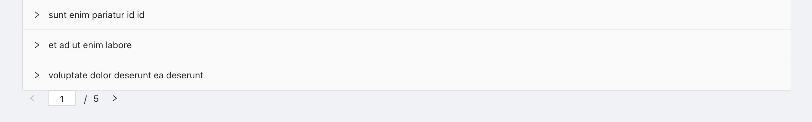
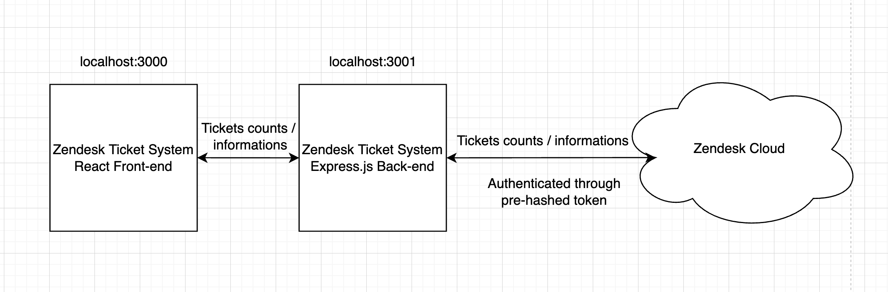

# Zendesk Ticket System

This is a ticket system project for Zendesk Coding Challenge. It provides a simple backend retrieving
detailted ticket informations from Zendesk Cloud. It also provides a web based demonstration page that splits tickets into viewable pages and allows user to review different pages.

 
 

# Backend Interfaces

Our backend provide two simple API interfaces:

1. GET /tickets/counts \
Provide total number of tickets stored in Zendesk Cloud.

2. GET /tickets/:pagenum \
Provide a list of ticket information based on the requested page number.

*Specifice API information will be provided at the app/README.md
 
 

# System Work Flow
  1. Front-end request '/tickets/counts' interfaces for the number of tickets. Using the total ticket number to caculate the number of pages that can be reviewed by user.

  2. Using the pre-hashed token for authentication, Our backend request https://zcclance.zendesk.com/api/v2/tickets/count for ticket count information.

  3. Then the front-end request '/tickets/1' as a default for first 25 tickets to be listed.

  4. Backend then request "https://zcclance.zendesk.com/api/v2/tickets/show_many.json?ids={ids}" for specific ticket information. "{ids}" is a string variable that dynamically generated by the backend for requesting specific range of tickets.

  5. Whenever user click another page, our front-end rerequest the '/tickets/:pagenum' as the pagenum will be setted to the clicked page num. Repeat the steps 3-4. Once the front-end receive a new list of tickets information, replaces all the demonstrating tickets to the newest ones.
 
 

# Diagram
